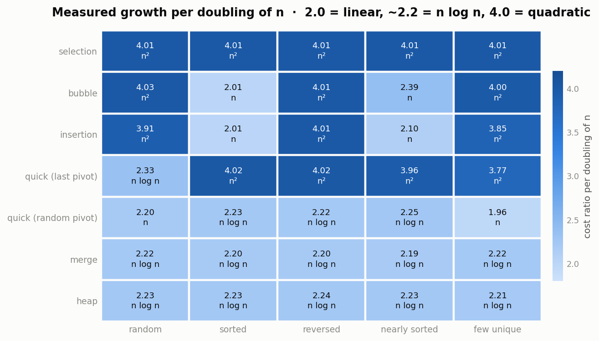
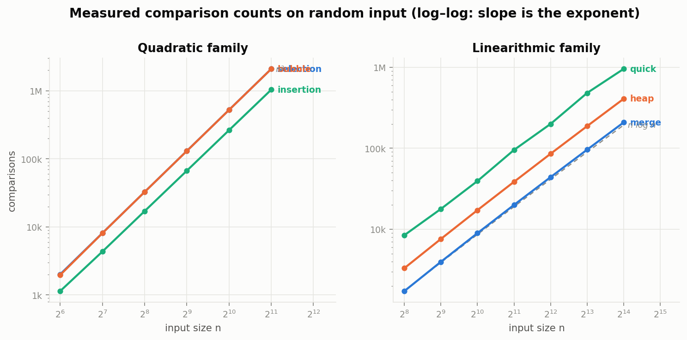
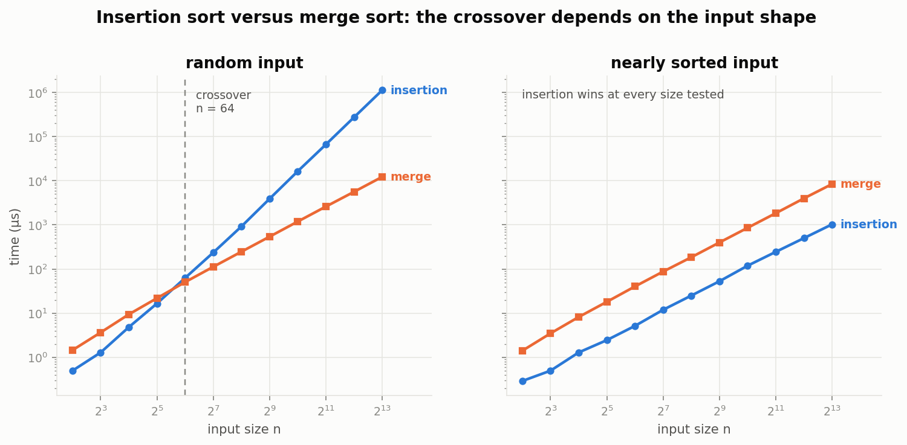
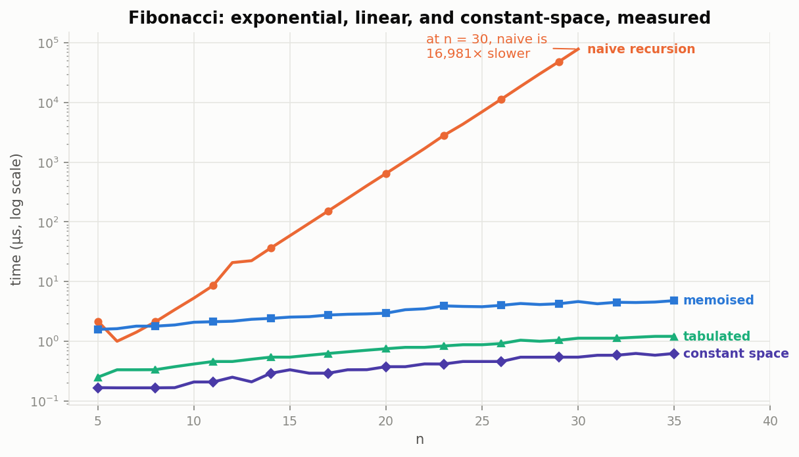
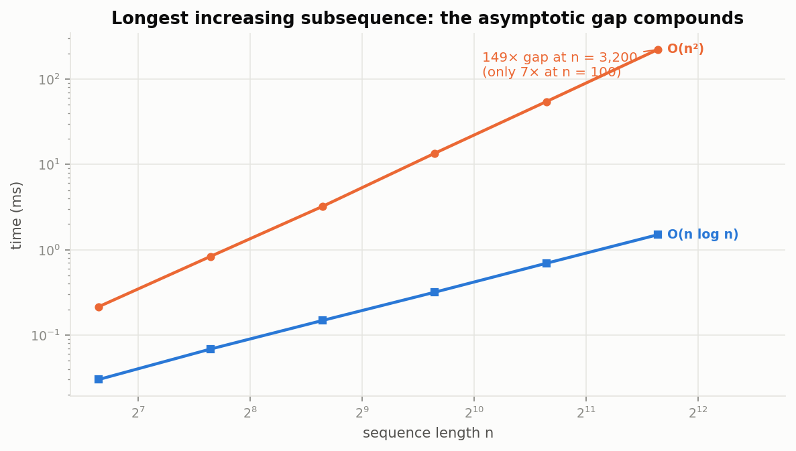
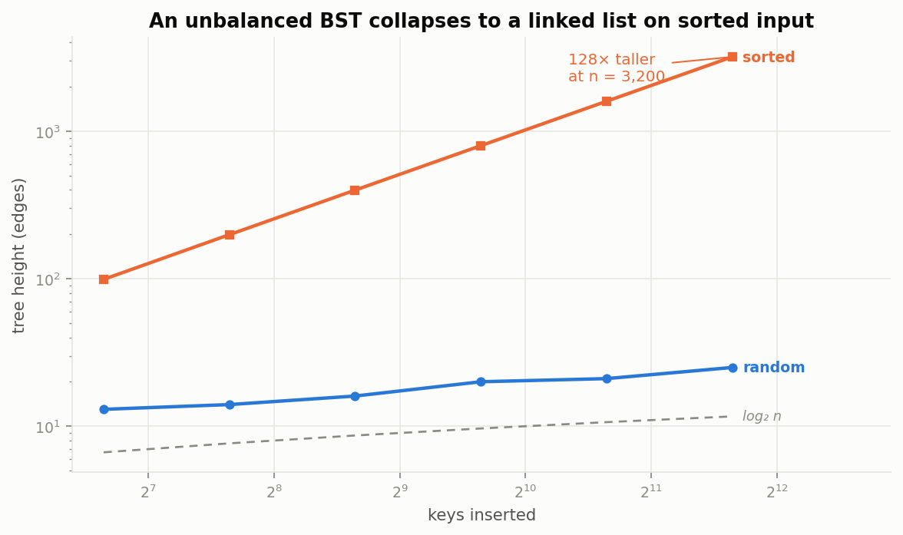
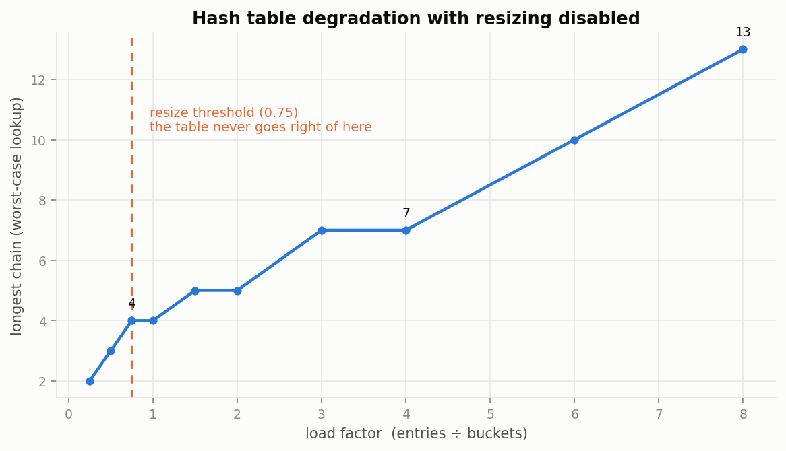
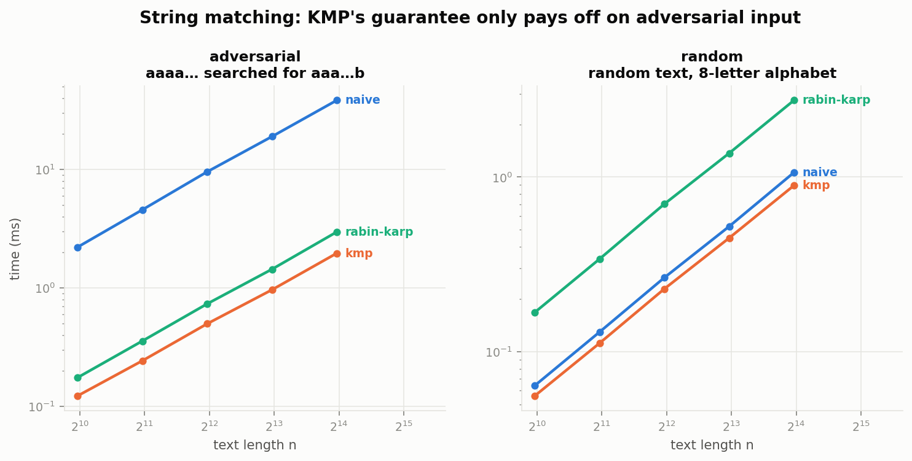

# Algorithms from Scratch

Forty-two algorithms and eight data structures implemented from first principles
in Python — and, more to the point, **measured**. Every complexity claim in this
repository is checked against instrumented data rather than quoted from a
textbook, and the places where the measurements contradicted my expectations are
written up in **[LEARNING_LOG.md](LEARNING_LOG.md)**.

That log is the actual deliverable. Anyone can implement bubble sort; the useful
part was finding out that selection sort does **1,024× more work than insertion
sort on already-sorted input**, that a bad quicksort pivot causes a
`RecursionError` rather than merely being slow, and that my own benchmark was
wrong before any of the algorithms were.


[](https://github.com/Shehan121/algorithms-from-scratch/actions/workflows/tests.yml)


---

## What makes this more than a solutions dump

**Nothing is asserted.** Complexity is *inferred* from measurements. Operation
counts are fitted against candidate growth curves, and the cost ratio per doubling
of n is reported — 2.0 means linear, ~2.2 means n log n, 4.0 means quadratic. If an
implementation does not behave as advertised, the table says so.

**Instrumentation without disturbing the code.** The algorithms contain no
counters. A `Probe` value counts every comparison it participates in and a
`TrackedList` counts reads and writes, so the *same* unmodified function is timed
on plain integers and counted on instrumented ones.

**Failure modes are first-class.** Naive quicksort, recursive DFS and the
unbalanced BST are all kept deliberately, because measuring where they break is
more instructive than only implementing the versions that work.

---

## Measured results

### Sorting: the same seven algorithms on five input shapes

Cost ratio per doubling of n, from exact comparison counts:



Reading the table:

- **Selection sort is 4.01 across every shape.** No best case, because finding
  each minimum must scan the whole suffix — there is nowhere to put an early exit.
- **Bubble and insertion sort drop to ~2.0 on sorted input.** Their adaptivity is
  real and measurable: 2,047 comparisons at n = 2048 against selection sort's
  2,096,128 on the same input.
- **The fixed-pivot quicksort is quadratic on four of five shapes** — everything
  except random. Randomising the pivot fixes it (6.9× fewer comparisons at n = 512
  on sorted input).
- **Merge and heap sort sit at 2.19–2.24 everywhere**, which is what a guaranteed
  bound looks like: no shape helps them and no shape hurts them.

On log-log axes each complexity class is a straight line whose slope is the
exponent:



### The insertion-sort crossover is about input shape, not size



| input shape | crossover | insertion at n = 8192 |
|---|---|---|
| random | **n = 64** | 92× slower than merge |
| nearly sorted | none up to 8192 | **8.2× faster** than merge |

The lines stay parallel on nearly-sorted input — same complexity class, not a
constant-factor edge. With displacement bounded by k, insertion sort is O(n·k).
This is why Timsort detects existing runs instead of only checking a size
threshold.

### Dynamic programming: one decorator, 16,981×



| n | naive | memoised | ratio |
|---|---:|---:|---:|
| 25 | 6.99 ms | 3.79 µs | 1,844× |
| 30 | 78.5 ms | 4.62 µs | **16,981×** |

The ratio itself grows with n, because the two are in different complexity classes.
The same compounding shows up in longest increasing subsequence — the O(n log n)
version's advantage grows from 7.1× at n = 100 to **149× at n = 3200**.



### An unbalanced BST discards its own reason for existing



At n = 3200, sorted insertion produces a tree **128× taller** than random
insertion — height exactly n−1. Every operation degrades to O(n) while still
returning correct answers, which is what makes it dangerous. Sorted insertion is
not an adversarial edge case; loading rows from an indexed table produces it.

### What the hash table's load factor is protecting



| load factor | longest chain |
|---|---:|
| 0.25 | 1 |
| **0.75** (resize threshold) | **4** |
| 8.0 | 13 |

Chain length *is* the worst-case lookup. O(1) is not a property of hashing but of
bounding n/m — the resize policy is not an implementation detail beneath the
guarantee, it is the guarantee.

### Asymptotically better can mean practically worse



At n = 16,000:

| input | naive | KMP | Rabin-Karp |
|---|---:|---:|---:|
| adversarial | 38.39 ms | **1.96 ms** | 2.85 ms |
| random text | **1.06 ms** | 0.90 ms | 2.75 ms |

KMP is 19.6× faster on adversarial input and only 1.19× faster on random text.
**Rabin-Karp is 2.6× slower than the naive algorithm** on random text — same
asymptotic class, much heavier constant. Big-O bounds the worst case; it promises
nothing about the input you actually have.

---

## What's implemented

**Sorting** (9) — bubble, insertion, selection, merge, quicksort (randomised
three-way and naive Lomuto), heap, counting, radix

**Searching** (6) — linear, binary (iterative, recursive, leftmost-boundary),
interpolation, exponential

**Data structures** (8) — linked list (with reversal, tortoise-and-hare middle and
cycle detection), stack, queue (two-stack, amortised O(1) dequeue), min-heap, BST,
hash table (separate chaining, resizing), trie, union-find (rank + path
compression)

**Graphs** (9) — BFS, DFS (iterative and recursive), unweighted shortest path,
Dijkstra, topological sort (Kahn), three-colour cycle detection, connected
components, Kruskal's MST

**Dynamic programming** (15) — Fibonacci in four forms, grid paths, LCS (length and
reconstruction), edit distance (full table and rolling rows), 0/1 knapsack (value
and item recovery), coin change, LIS (O(n²) and O(n log n))

**String matching** (3) — naive, KMP with prefix table, Rabin-Karp rolling hash

---

## Tests

```
273 passed in 0.13s
```

Correctness is defined as **agreeing with a reference implementation** — sorts
against `sorted()`, the hash table against `dict` under 2,000 random operations,
searches against a linear scan, the O(n log n) LIS against the O(n²) one. Edge
cases come first: empty, single-element, all-equal, already-sorted and reversed
inputs break more implementations than large random ones.

Some tests exist to pin down behaviour that is easy to get wrong or easy to
misremember:

| Test | What it pins down |
|---|---|
| `test_selection_sort_comparison_count_is_exact` | Exactly n(n−1)/2 comparisons — a closed form, so the counter is verified against arithmetic, not plausibility |
| `test_selection_sort_is_not_stable` | Asserts a real limitation instead of glossing over it |
| `test_recursive_dfs_overflows_where_iterative_does_not` | Recursive DFS raises `RecursionError` on a 20,000-node path; the iterative version does not |
| `test_memo_is_stack_bounded` | Memoised Fibonacci still recurses n deep — the cache buys the complexity class, not the depth |
| `test_degenerate_tree_is_a_list` | BST height is exactly n−1 after sorted insertion |
| `test_greedy_would_be_wrong` | Coins `[1,3,4]` making 6: greedy gives 3 coins, DP gives 2 |
| `test_greedy_by_density_is_not_optimal` | Why 0/1 knapsack cannot be solved greedily |
| `test_diamond_is_not_a_cycle` | The case a two-colour DFS gets wrong |
| `test_path_compression_keeps_the_forest_flat` | 1,000 chained unions leave a forest at most 2 deep |
| `test_dijkstra_rejects_negative_weights` | Fails loudly rather than returning a silently wrong answer |

---

## Running it

Python 3.10+. **No runtime dependencies** — the algorithms use only the standard
library. `matplotlib` is needed for the figures and `pytest` for the tests.

```bash
pip install -r requirements.txt

pytest                              # 273 tests
python scripts/run_benchmarks.py    # measure everything -> reports/*.csv
python scripts/make_figures.py      # reports/figures/*.png
```

Measuring one algorithm yourself:

```python
from algokit.instrument import instrument
from algokit.sorting import insertion_sort

tracked, ops = instrument([5, 3, 9, 1, 7])
insertion_sort(tracked)
print(ops.comparisons)      # 7
```

Inferring a complexity class from measurements:

```python
from algokit.benchmark import sweep_ops, random_list
from algokit.complexity import describe
from algokit.sorting import merge_sort

sizes = [256, 512, 1024, 2048, 4096]
counts = [c.ops.comparisons for c in sweep_ops(merge_sort, sizes, random_list)]
print(describe(sizes, counts))
# best fit: O(n log n)  (R^2 = 1.0000)
#   next:   O(n)         R^2 = 0.9985
#   ratios per step: 2.30, 2.26, 2.23, 2.20
```

---

## Honest limitations

- **Curve fitting cannot separate adjacent classes.** Randomised quicksort is
  classified as O(n) on random input; it is O(n log n). Over n = 256…16,384,
  `n log n` grows only ~1.5× faster than `n`, so both models fit. The doubling
  ratio (2.20, matching provably-O(n log n) merge sort's 2.22) is the more honest
  statistic, and the fitted label should be read as a hint.
- **Python's constant factors are large**, so wall-clock comparisons against a
  compiled language are not meaningful. The comparison *counts* are
  language-independent, which is why they carry the complexity claims here.
- **Timings are machine-specific.** Measured on Apple Silicon, Python 3.13.9,
  taking the minimum of several repeats with the garbage collector disabled.
  Ratios should reproduce; absolute numbers will not.
- **Only six growth classes are considered.** A genuinely O(n^1.5) algorithm would
  be reported as whichever neighbour fits least badly.
- **`Probe` counts comparison *operations*, not primitive `__lt__` calls.**
  `@total_ordering` derives `>` from `__lt__`, so a single `a > b` registers as one
  comparison — which is the quantity textbook analysis discusses, but not the same
  as CPU-level instruction counts.
- **Only comparison counts are meaningful for the sorts.** Each sort begins with
  `a = list(seq)` so it never mutates the caller's data, which means the tracked
  list observes the copy and nothing afterwards — read and write counts would
  describe the copy, not the sort. Comparisons survive because `Probe` elements are
  copied by reference and keep reporting to the same tally. The sort benchmarks
  therefore record comparisons only, and every complexity claim above rests on
  them. Read and write counts are meaningful only for algorithms that work on the
  tracked list directly.

## Project structure

```
src/algokit/
├── instrument.py       Probe + TrackedList — count without touching algorithms
├── complexity.py       fit measurements against candidate growth curves
├── benchmark.py        timing/counting sweeps, five input-shape generators
├── sorting.py          9 sorts
├── searching.py        6 searches
├── graphs.py           traversal, shortest paths, ordering, MST
├── dynamic.py          DP, each problem built up from the naive version
├── strings.py          naive, KMP, Rabin-Karp
└── structures/         linked list, stack/queue, heap, BST, hash table, trie, union-find
scripts/
├── run_benchmarks.py   writes reports/*.csv
└── make_figures.py     writes reports/figures/*.png
tests/                  273 tests, reference-implementation based
reports/                measurements + 8 figures
LEARNING_LOG.md         what the measurements corrected
```

## Author

**Shehan Nimsara** — B.Sc. Software Design (International), TH Aschaffenburg
